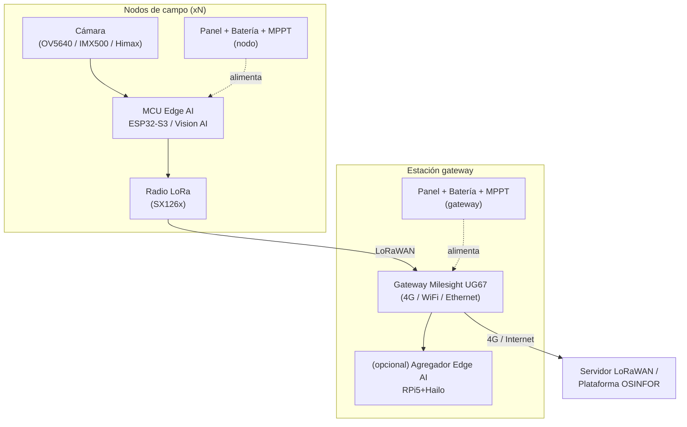

# Arquitectura de Sistema

| Estado | Versión | Fecha |
|---|---|---|
| En revisión | 0.2 | 2026-06-11 |

## Diagrama de bloques

## Familias de nodo (decisión en ADR-001)

- **Nodo A — bajo consumo:** detección on-sensor (Himax/IMX500) + ESP32-S3 + LoRa. ~0,3 W.
- **Nodo B — alto desempeño:** RPi5+Hailo con inferencia continua. ~8–10 W.

## Partición Hardware / Firmware / Software

| Capa | Responsabilidad |
|---|---|
| Hardware | Sensado, energía, radio, gabinete (ver `03-diseno-hardware/`) |
| Firmware | Captura, inferencia TinyML, gestión de energía, pila LoRaWAN (ver `04-...`) |
| Software/Backend | Servidor LoRaWAN, ingestión y visualización (fuera de alcance HW) |
