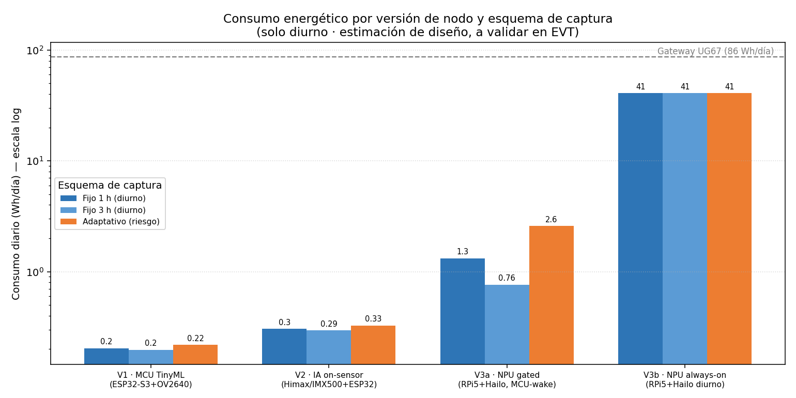
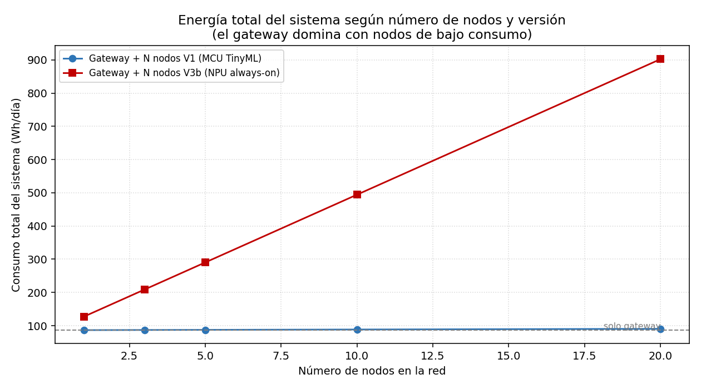

# Análisis de potencia y balance energético
### Nodo Edge AI (V1/V2/V3) + Gateway LoRaWAN

| | |
|---|---|
| **Estado** | Aprobado (v2.0) |
| **Fecha** | 2026-06-11 |
| **Responsable** | Área Técnica — DSFFFS / OSINFOR |
| **Relacionado** | `ADR-001`, `comparacion-versiones.md`, `../04-diseno-firmware-software/cadencia-captura.md`, EETT fotovoltaica |
| **Cambios v2.0** | Modelo basado en **captura por intervalos, solo de día**. Se añaden las 3 versiones de nodo. |

---

## 1. Objetivo

Evaluar el consumo de las **tres versiones de nodo** y del **gateway** bajo captura por
intervalos diurna, para dimensionar el sistema fotovoltaico.

## 2. Supuestos

| Parámetro | Valor | Justificación |
|---|---|---|
| HSP (sol pico) | 3,5 h/día | Loreto, conservador (nubosidad/lluvia) |
| Pérdidas globales | 30 % (×0,70) | MPPT, temp, suciedad, cableado |
| DoD | 80 % | LiFePO4 |
| η conversión | 85 % | DC-DC y conductores |
| Banco | 12,8 V | LiFePO4 4S |
| Autonomía | 2,5 días | Sin radiación útil |
| Ventana diurna | 12 h (~06:00–18:00) | Humo visible solo de día [R02][R04] |

> Las cifras de consumo son **estimaciones de diseño** (datasheet + ciclo de trabajo de la
> literatura). Se validan por medición en EVT (`../06-verificacion-validacion/pruebas-de-energia.md`).

## 3. Consumo por componente (datasheet)

| Componente | Rol | Consumo | Fuente |
|---|---|---|---|
| Milesight **UG67** | Gateway LoRaWAN (4G/WiFi/Eth integrados) | **Típ. 3,6 W · Máx 4,8 W** | Datasheet UG67 |
| **RPi 5 + AI HAT+ (Hailo-8)** | Cómputo NPU 13 TOPS (V3) | ~8–10 W activo | RPi5 + Hailo-8 (est.) |
| **ESP32-S3** (XIAO/NE101/NEO101) | MCU + TinyML (V1/V2) | ~0,5 W activo; µW sleep | Plataforma ultrabajo consumo (est.) |
| **Grove/XIAO Vision AI** (Himax) / **RPi AI Cam** (IMX500) | IA on-sensor (V2) | ~0,05–0,15 W inferencia | Sensores IA bajo consumo (est.) |
| Radio **LoRa nodo** (SX126x, integrada) | Transmisión por evento | TX ~0,4 W ráfaga | Familia SX126x (est.) |
| Cámara OV5640/OV2640 | Sensor imagen | ~0,3–0,4 W activo | Datasheet OV5640 (est.) |

## 4. Modelo de energía (captura por intervalos, diurno)

Herramienta: `_herramientas/energy_model.py` (paramétrico y reproducible).
`Wh/día = P_standby×24 + n_capturas×E_captura + n_tx×E_tx` (modo always-on: idle×horas).

### 4.1 Resultados por versión y esquema de captura

| Versión | Fijo 1 h | Fijo 3 h | Adaptativo (~30/día) |
|---|---|---|---|
| **V1 · MCU TinyML** | 0,203 Wh/día | 0,197 Wh/día | 0,218 Wh/día |
| **V2 · IA on-sensor** | 0,304 Wh/día | 0,295 Wh/día | 0,326 Wh/día |
| **V3a · NPU (gated)** | 1,322 Wh/día | 0,762 Wh/día | 2,582 Wh/día |
| **V3b · NPU (always-on)** | 40,8 Wh/día | 40,8 Wh/día | 40,8 Wh/día |

### 4.2 Dimensionamiento mínimo resultante

| Elemento | Consumo | Batería mín. | Panel mín. |
|---|---|---|---|
| Nodo V1 / V2 | 0,2–0,3 Wh/día | < 0,1 Ah | < 1 Wp |
| Nodo V3 (gated) | 0,8–2,6 Wh/día | ~0,2–0,7 Ah | ~1–2 Wp |
| Nodo V3 (always-on) | 40,8 Wh/día | ~12 Ah | ~33 Wp |
| **Gateway UG67 (típ.)** | **86 Wh/día** | **~25 Ah** | **~71 Wp** |
| Gateway UG67 (máx.) | 115 Wh/día | ~33 Ah | ~94 Wp |

## 5. Hallazgos

1. **V1 y V2 consumen ~0,2–0,3 Wh/día y están dominados por el standby**: el intervalo de
   captura tiene un efecto energético no significativo. → La cadencia se elige por **latencia**, no por
   energía (ver `../04-diseno-firmware-software/cadencia-captura.md`).
2. **V3 solo es viable con disparo por evento / arranque controlado** (~1–2 Wh/día). En
   *always-on* consume ~41 Wh/día (≈100× V1) y obliga a un sistema solar grande.
3. **El gateway UG67 es el principal consumidor del sistema.** Con operación 24/7 son ~86 Wh/día;
   con **apagado nocturno programado y 4G por demanda** baja a ~50 Wh/día (panel 50 W, batería 20 Ah).
   El consumo de los nodos de bajo consumo es marginal en comparación.
4. **El dimensionamiento de la EETT vigente (gateway 300 Wp/120 Ah) está sobredimensionado**
   para la carga real del UG67: bastan **~95 Wp / ~35 Ah** (2,5 días) e incluso con
   margen 2× → **~150 Wp / ~60 Ah**. El nodo necesita un panel/batería mínimos.

## 6. Recomendación de actualización de la EETT fotovoltaica

| Subsistema | EETT vigente | Recomendado |
|---|---|---|
| Gateway — panel | 300 Wp | **50 W** (operación diurna; apagado nocturno) |
| Gateway — batería | 120 Ah | **20 Ah** (≈3 días, diurno) |
| Gateway — MPPT | 30 A | 10–20 A |
| Nodo — panel | 20 Wp | **5 W · 6 V** (compacto, montaje en árbol) |
| Nodo — batería | 15 Ah | **1 celda 1S: LiFePO4 32700 6 Ah o Li-ion 18650 ≥ 2,5 Ah** |
| Nodo — MPPT | 10 A | **cargador solar MPPT 1S ≤ 2 A** |

> Un margen mayor incrementa la fiabilidad; no obstante, existe un margen de reducción de
> costo cuantificable. La cifra final depende de `ADR-001` (versión de nodo) y de la medición EVT.

## 7. Verificación

Validar con medición de consumo de 24 h por subsistema y modo, en banco y en campo
(`../06-verificacion-validacion/pruebas-de-energia.md`). Referencias: [R06][R08][R11][R12].
