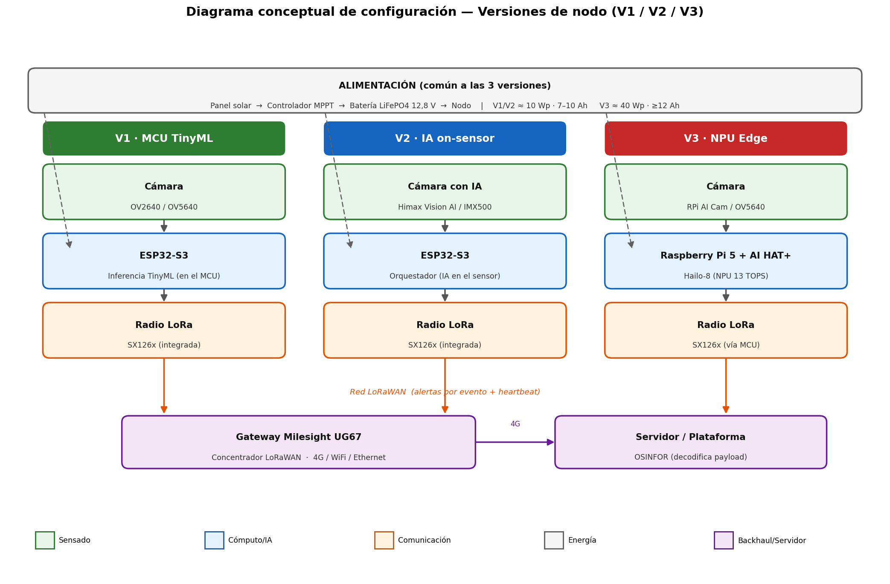

# Comparación de las 3 versiones de nodo
### Hardware · Firmware · Modelo TinyML

| Estado | Versión | Fecha |
|---|---|---|
| En revisión | 0.9 | 2026-06-11 |

> El kit de validación permite construir tres versiones de nodo; el piloto desplegará una.
> Esta tabla guía la decisión `ADR-001`.

## 1. Matriz comparativa

| Criterio | **V1 · MCU TinyML** | **V2 · IA on-sensor** | **V3 · NPU Edge** |
|---|---|---|---|
| Cómputo | XIAO ESP32-S3 / NE101 | ESP32-S3 + cámara IA | Raspberry Pi 5 + AI HAT+ (Hailo-8, 13 TOPS) |
| Cámara | OV2640 / OV5640 | Grove Vision AI (Himax) o RPi AI Cam (IMX500) | RPi AI Cam / OV5640 |
| Dónde infiere | CNN pequeña en el MCU | En el sensor (Himax/IMX500) | Modelo grande en el NPU |
| Capacidad del modelo | Baja (clasificación binaria humo/no) | Media (detección con buen recall) | Alta (detección robusta, separa humo de niebla/nube) |
| Consumo (1 h diurno) | **0,20 Wh/día** | **0,30 Wh/día** | 1,3 Wh/día (gated) · 41 Wh/día (always-on) |
| Batería / panel mínimos | ~0,06 Ah / <1 Wp | ~0,09 Ah / <1 Wp | gated ~0,4 Ah / ~1 Wp · always-on ~12 Ah / ~33 Wp |
| Costo relativo | Bajo | Bajo-medio | Alto |
| Complejidad firmware | Media (TinyML en MCU) | Baja-media (sensor hace IA) | Alta (Linux, gestión de arranque/sleep) |
| Madurez para campo | Alta | Alta | Media (gestión térmica y de energía) |

*(Consumos del modelo `_herramientas/energy_model.py`; estimaciones de diseño a validar en EVT.)*

## 2. Configuración por versión (diagrama de bloques)

Las tres versiones comparten la misma cadena funcional —**sensado → cómputo/inferencia →
comunicación LoRa → gateway → servidor**— y el mismo subsistema de alimentación solar;
difieren en **dónde se ejecuta la inferencia** y, por tanto, en la capacidad de cómputo y el
consumo.

### Lista mínima de componentes por versión

| Componente | V1 · MCU TinyML | V2 · IA on-sensor | V3 · NPU Edge |
|---|---|---|---|
| Cámara | OV2640 / OV5640 | Himax Vision AI / IMX500 | RPi AI Cam / OV5640 |
| Cómputo | ESP32-S3 | ESP32-S3 | Raspberry Pi 5 + AI HAT+ (Hailo-8) |
| Radio LoRa | SX126x integrada | SX126x integrada | SX126x (vía MCU) |
| Almacenamiento | microSD (opcional) | microSD (opcional) | microSD / SSD |
| Panel / Batería / MPPT | 10 Wp / 7–10 Ah / 10 A | 10 Wp / 7–10 Ah / 10 A | ≥40 Wp / ≥12 Ah / 10–20 A |
| Antena LoRa | Sí | Sí | Sí |
| Carcasa | IP67 | IP67 | IP67 + disipación térmica |

**Común a las tres versiones:** gateway Milesight UG67 (LoRaWAN + 4G) y servidor/plataforma de
recepción que decodifica el payload.

## 3. Lectura de los resultados

- **V1 y V2 presentan un consumo equivalente** (~0,2–0,3 Wh/día), dominado por el standby; el
  intervalo de captura no es significativo energéticamente (ver `cadencia-captura.md`). La
  diferencia entre ambas reside en la **precisión del modelo**, no en el consumo.
- **V3 solo es viable con disparo por evento / arranque controlado** (1–2 Wh/día). En modo
  *always-on* consume ~41 Wh/día — 100× más — y exige el sistema solar grande.
- **Con nodos V1/V2, el gateway UG67 (86 Wh/día) es el componente dominante del sistema** (ver gráfico
  `_recursos/energia-sistema-vs-nodos.png`).

## 4. Plan de comparación (EVT)

Durante EVT se medirá en banco, por versión:
1. **Consumo real** por modo (sleep, captura, inferencia, TX) — valida el modelo de energía.
2. **Desempeño del modelo TinyML** de detección de columnas de humo: precisión, recall y
   **tasa de falsos positivos** (determinante con niebla/nubes amazónicas) — dataset tipo PyroNear [R03].
3. **Latencia** captura→alerta y alcance LoRa en selva.

## 5. Recomendación preliminar

> **V2 (IA on-sensor)** como candidata principal del piloto: mejor relación precisión/consumo
> y menor complejidad de firmware (la inferencia se ejecuta en el sensor). **V1** como respaldo de mínimo costo/energía,
> y **V3** como referencia de precisión para *benchmark*. Decisión final tras medir
> desempeño del modelo en EVT → `ADR-001`.
