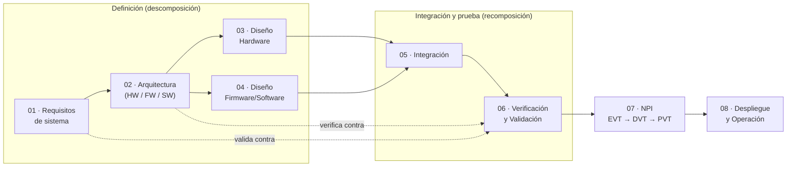

# Documentación de Diseño e Ingeniería
## Proyecto Amazonía+ — Nodo Edge AI + Gateway LoRaWAN (OSINFOR · CCNN Pahoyan, Loreto)

Este repositorio contiene **toda la documentación técnica** del diseño del sistema de
detección temprana de incendios forestales basado en Edge AI y comunicación LoRaWAN.
Está organizado siguiendo una metodología híbrida **V-Model (ingeniería de sistemas) +
fases NPI (EVT/DVT/PVT)**, pensada para productos que combinan **hardware, firmware y
software**.

> **Por qué esta estructura.** El cuello de botella de la mayoría de proyectos IoT/Edge no
> es el diseño, es la documentación dispersa y desordenada. Aquí cada decisión, cálculo,
> requisito y prueba tiene **un único lugar** donde vive, con trazabilidad de punta a punta.

---

## 1. La metodología en una imagen

En el **V-Model**, el lado izquierdo descompone el problema (de requisitos a diseño de
detalle) y el lado derecho lo recompone y verifica (de integración a validación). Cada
nivel de la izquierda tiene su **contraparte de prueba** en la derecha:

| Nivel de diseño | Se verifica/valida en |
|---|---|
| Requisitos de sistema | Validación en campo (06) |
| Arquitectura | Pruebas de integración (06) |
| Diseño HW / FW | Pruebas unitarias y de energía (06) |

Las **fases NPI** son las compuertas de madurez del hardware:
- **EVT** (Engineering Validation Test): ¿funciona el diseño? Prototipos de ingeniería.
- **DVT** (Design Validation Test): ¿cumple todas las especificaciones (IP67, térmico, energía)?
- **PVT** (Production Validation Test): ¿se puede fabricar/replicar de forma repetible?

---

## 2. Mapa de carpetas

| Carpeta | Qué vive aquí | Disciplina |
|---|---|---|
| `00-gestion/` | Plan, registro de decisiones (ADR), riesgos, glosario | Gestión |
| `01-requisitos/` | Requisitos de sistema, HW, FW/SW y matriz de trazabilidad | Sistemas |
| `02-arquitectura/` | Arquitectura de sistema, diagrama de bloques, interfaces (ICD) | Sistemas |
| `03-diseno-hardware/` | **Análisis de potencia**, BOM, selección de componentes, esquemáticos, mecánica | Hardware |
| `04-diseno-firmware-software/` | Arquitectura de firmware, modelo Edge AI, protocolo LoRaWAN, gestión de energía | Firmware/SW |
| `05-integracion/` | Plan y bitácora de integración HW+FW | Sistemas |
| `06-verificacion-validacion/` | Plan de pruebas, pruebas de energía, validación en campo | V&V |
| `07-npi-evt-dvt-pvt/` | Compuertas de madurez del producto | NPI |
| `08-despliegue-operacion/` | Despliegue, mantenimiento y operación | Operación |
| `_plantillas/` | Plantillas reutilizables (requisito, ADR, caso de prueba, doc de diseño) | — |
| `_recursos/` | Imágenes, diagramas, datasheets de referencia | — |

---

## 3. Convenciones de documentación (cómo no perder el orden)

1. **Un documento, un propósito.** No mezclar requisitos con diseño ni con pruebas.
2. **Identificadores estables.** Requisitos `REQ-SYS-001`, hardware `REQ-HW-001`, firmware
   `REQ-FW-001`; decisiones `ADR-001`; pruebas `TC-001`. Nunca se reutiliza un ID.
3. **Trazabilidad.** Todo requisito enlaza con su origen (EETT/cliente) y con la prueba que
   lo verifica → ver `01-requisitos/matriz-trazabilidad.md`.
4. **Decisiones como ADR.** Cualquier decisión de arquitectura relevante se registra como un
   *Architecture Decision Record* en `00-gestion/registro-de-decisiones-adr.md`. Las ADR no
   se borran: se marcan como *Reemplazada* por una nueva.
5. **Estado en cada documento.** Cada archivo arranca con una cabecera: `Estado`
   (Borrador/En revisión/Aprobado), `Versión`, `Fecha`, `Responsable`.
6. **Markdown como fuente de verdad** (docs-as-code, versionable con Git). Los entregables
   formales (memoria de cálculo, informe de diseño) se exportan a Word/PDF cuando se requiere.
7. **Los datasheets mandan.** Toda cifra de consumo, voltaje o térmica debe citar su fuente
   (datasheet + página). Las estimaciones se marcan explícitamente como *estimación*.

---

## 4. Estado actual del proyecto

| Fase | Estado | Nota |
|---|---|---|
| 01 Requisitos | 🟡 En curso | Derivados de las EETT del sistema Edge AI + LoRaWAN; falta congelar |
| 02 Arquitectura | 🟢 Avanzado | 3 versiones de nodo (V1/V2/V3) definidas |
| 03 Diseño HW | 🟢 Avanzado | **Análisis de potencia v2** (3 versiones) + comparativa + modelo Python |
| 04 Diseño FW/SW | 🟡 En curso | Cadencia de captura y payload LoRa documentados con literatura |
| 06 V&V | 🔴 Pendiente | Medición de energía y desempeño es el siguiente paso (EVT) |
| 07 NPI | 🔴 Pendiente | — |

**Próximo hito:** ejecutar **EVT** (medir consumo y desempeño del modelo TinyML por versión)
para congelar `ADR-001` (versión de nodo) y cerrar el dimensionamiento del sistema fotovoltaico.

## 4.1 Herramientas

- `_herramientas/energy_model.py` — modelo de energía paramétrico; genera las tablas y los
  gráficos de `_recursos/`. Reejecutar tras cualquier cambio de BOM o cadencia con
  `python3 _herramientas/energy_model.py`.
