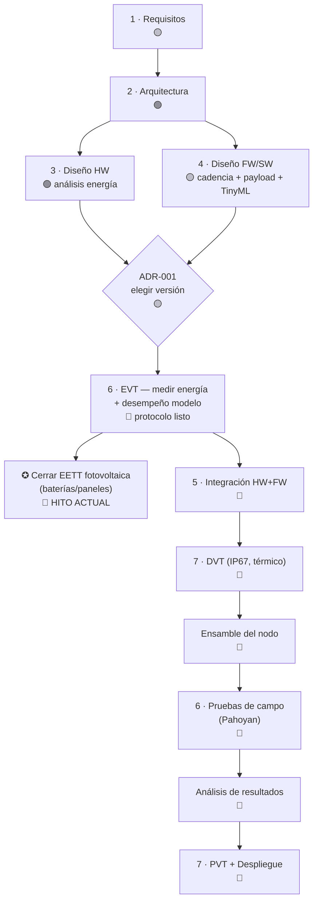

# 📋 SEGUIMIENTO DE DOCUMENTACIÓN — Proyecto Amazonía+ (Nodo Edge AI + Gateway LoRaWAN)

> Tablero maestro de **toda** la documentación de diseño. Permite ver el avance de forma
> **secuencial y coherente** — desde requisitos hasta ensamble, pruebas en banco, pruebas de
> campo y análisis de resultados. Se actualiza cada vez que un documento cambia de estado.

**Última actualización:** 2026-09-05

---

## 🎯 Hito actual

> **VALIDAR LOS REQUISITOS DE ENERGÍA** para proponer la **EETT de baterías, paneles y
> accesorios**.

Para cerrar este hito falta:

1. ✅ Modelo de energía de las 3 versiones — *hecho* (`03-.../analisis-de-potencia.md`).
2. ✅ Recomendación de cadencia de captura con literatura — *hecho* (`04-.../cadencia-captura.md`).
3. 🟢 **Versión de nodo: V1/V2** (bajo consumo) elegida para el piloto; pick final V1 vs V2 tras EVT.
4. 🔴 **Medir consumo real en banco** (EVT) — protocolo listo (`06-.../pruebas-de-energia.md`), *falta ejecutar*.
   ⚠️ El modelo entrenado exige **32 inferencias por captura** (rejilla de teselas,
   ver `04-.../modelo-edge-ai.md` §8.1), o sea ~1 500 inferencias/día con la
   cadencia de 15 min. `analisis-de-potencia.md` supone una sola inferencia por
   captura: hay que medir el costo real de la rejilla antes de cerrar la EETT.
5. 🟡 **EETT de 3 ítems armado** (gateway diurno: panel 50 W + 20 Ah · nodo ×3: panel 5 W 6 V + celda 1S comercial 32700/18650), listo para cotizar; confirmar tras EVT.

*El resto de fases (firmware completo, ensamble, campo) vendrá después; aquí solo se listan
para mantener la coherencia del camino.*

---

## 🧭 Leyenda de estado

| Símbolo | Estado |
|---|---|
| 🟢 | Aprobado / contenido sólido |
| 🟡 | En curso / borrador con contenido |
| 🔴 | Pendiente / plantilla vacía |
| 🧰 | Herramienta o dato (no documento narrativo) |

**Tipos de documento:** `Análisis` · `Memoria` · `Protocolo` · `Plan` · `Especificación` ·
`Decisión (ADR)` · `Plantilla` · `Referencia` · `Herramienta` · `Registro`.

---

## 🔢 Secuencia de construcción (camino crítico)

---

## 🗂️ Catálogo por CATEGORÍA

### A · Gestión (`00-gestion/`)
| Documento | Tipo | Estado | Próxima acción |
|---|---|---|---|
| `SEGUIMIENTO.md` (este) | Seguimiento | 🟢 | Mantener al día |
| `plan-de-proyecto.md` | Plan | 🔴 | Completar cronograma e hitos |
| `registro-de-decisiones-adr.md` | Decisión | 🟡 | Cerrar ADR-001 tras EVT |
| `registro-de-riesgos.md` | Plan | 🔴 | Poblar matriz de riesgos |
| `glosario.md` | Referencia | 🔴 | Completar términos |
| `referencias.md` | Referencia | 🟢 | Añadir fuentes nuevas |
| `guia-de-documentacion.md` | Referencia | 🟢 | Consultar al iniciar cada fase |

### B · Requisitos (`01-requisitos/`) — *Sistema*
| Documento | Tipo | Estado | Próxima acción |
|---|---|---|---|
| `requisitos-de-sistema.md` | Especificación | 🟡 | Congelar y aprobar |
| `requisitos-hardware.md` | Especificación | 🔴 | Derivar de arquitectura |
| `requisitos-firmware-software.md` | Especificación | 🔴 | Derivar de cadencia/payload |
| `matriz-trazabilidad.md` | Especificación | 🔴 | Enlazar REQ ↔ pruebas |

### C · Arquitectura (`02-arquitectura/`) — *Sistema*
| Documento | Tipo | Estado | Próxima acción |
|---|---|---|---|
| `arquitectura-de-sistema.md` | Análisis | 🟢 | Refinar tras ADR-001 |
| `interfaces-icd.md` | Especificación | 🔴 | Definir interfaces cámara/MCU/radio/energía |

### D · Hardware (`03-diseno-hardware/`)
| Documento | Tipo | Estado | Próxima acción |
|---|---|---|---|
| `analisis-de-potencia.md` (+ `.docx`) | Memoria | 🟢 | Recalibrar con datos EVT |
| `comparacion-versiones.md` (+ `.docx`) | Análisis | 🟢 | Cerrar con resultados EVT |
| `bom.md` | Especificación | 🟢 | Fijar BOM final del nodo elegido |
| `seleccion-de-componentes.md` | Análisis | 🔴 | Comparativa cámara/cómputo |
| `esquematicos-pcb.md` | Especificación | 🔴 | Solo si hay placa propia |
| `mecanica-carcasa.md` | Especificación | 🔴 | Integración IP67 + térmica |

### E · Firmware / Software (`04-diseno-firmware-software/`)
| Documento | Tipo | Estado | Próxima acción |
|---|---|---|---|
| `cadencia-captura.md` (+ `.docx`) | Análisis | 🟢 | Confirmar en ADR-001 |
| `protocolo-lorawan.md` (+ `.docx`) | Especificación | 🟡 | Definir *decoder* y umbrales |
| `modelo-edge-ai.md` | Plan | 🟢 | v1.0: dataset construido y línea base entrenada (`MODELO-TINYML/`). Ver §8 (enmiendas) |
| `arquitectura-firmware.md` | Especificación | 🔴 | Máquina de estados + sleep |
| `gestion-de-energia.md` | Especificación | 🔴 | Política adaptativa (firmware) |

### F · Integración (`05-integracion/`)
| Documento | Tipo | Estado | Próxima acción |
|---|---|---|---|
| `plan-de-integracion.md` | Plan | 🔴 | Definir orden de integración |

### G · Verificación y Validación (`06-verificacion-validacion/`)
| Documento | Tipo | Estado | Próxima acción |
|---|---|---|---|
| `pruebas-de-energia.md` | Protocolo | 🟢 | **Ejecutar (EVT) — clave del hito** |
| `plantilla-registro-energia.csv` | Registro | 🧰 | Llenar durante EVT |
| `plan-de-pruebas.md` | Plan | 🔴 | Matriz prueba ↔ requisito |
| `validacion-en-campo.md` | Protocolo | 🔴 | Preparar para fase de campo |

### H · NPI (`07-npi-evt-dvt-pvt/`)
| Documento | Tipo | Estado | Próxima acción |
|---|---|---|---|
| `npi-gates.md` | Plan | 🔴 | Checklist por compuerta EVT/DVT/PVT |

### I · Despliegue / Operación (`08-despliegue-operacion/`)
| Documento | Tipo | Estado | Próxima acción |
|---|---|---|---|
| `despliegue-y-mantenimiento.md` | Plan | 🔴 | Procedimiento de instalación |

### 🧰 Herramientas y recursos
| Elemento | Tipo | Estado |
|---|---|---|
| `_herramientas/energy_model.py` | Herramienta | 🟢 |
| `_recursos/energia-por-version.png` | Gráfico | 🟢 |
| `_recursos/energia-sistema-vs-nodos.png` | Gráfico | 🟢 |
| `_plantillas/*` (ADR, requisito, caso de prueba, doc de diseño) | Plantilla | 🟢 |

---

## 🏷️ Vista por TIPO de documento

- **Memorias / Análisis (lo cuantitativo):** `analisis-de-potencia`, `comparacion-versiones`,
  `cadencia-captura`, `arquitectura-de-sistema`.
- **Protocolos de prueba:** `pruebas-de-energia` (listo), `validacion-en-campo` (pendiente),
  `plan-de-pruebas`.
- **Especificaciones:** requisitos (sistema/HW/FW), `protocolo-lorawan`, `bom`, `interfaces-icd`.
- **Decisiones (ADR):** `registro-de-decisiones-adr` (ADR-000 ✅, ADR-001 🟡).
- **Planes:** `plan-de-proyecto`, `plan-de-integracion`, `npi-gates`, `despliegue-y-mantenimiento`.
- **Plan técnico de IA:** `modelo-edge-ai` (dataset/entrenamiento/métricas).
- **Plantillas y herramientas:** `_plantillas/`, `_herramientas/energy_model.py`.
- **Referencias:** `referencias.md` (22 fuentes citadas con `[Rxx]`).

---

## ✅ Compuertas (NPI)

| Compuerta | Pregunta | Estado |
|---|---|---|
| **EVT** | ¿Funciona el diseño? ¿El consumo y el modelo TinyML cumplen? | 🔴 Por ejecutar |
| **DVT** | ¿Cumple TODAS las specs (IP67, térmico, energía, alcance)? | 🔴 |
| **PVT** | ¿Es replicable de forma repetible? | 🔴 |
"""